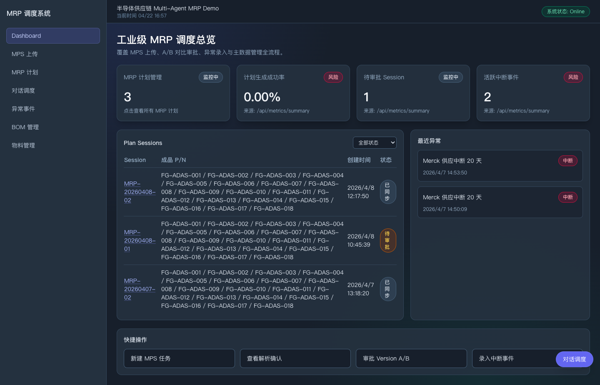
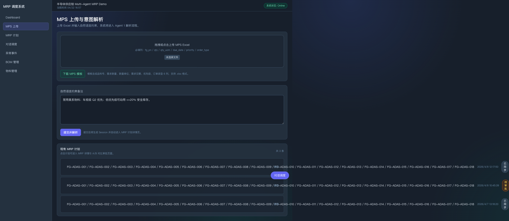
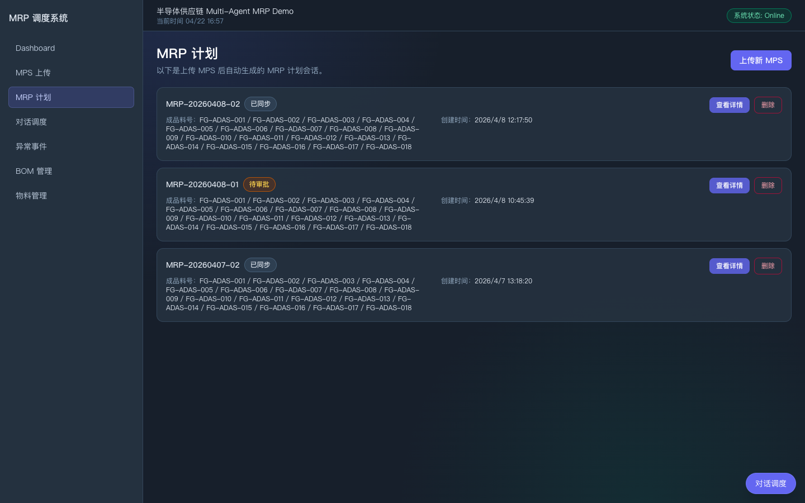
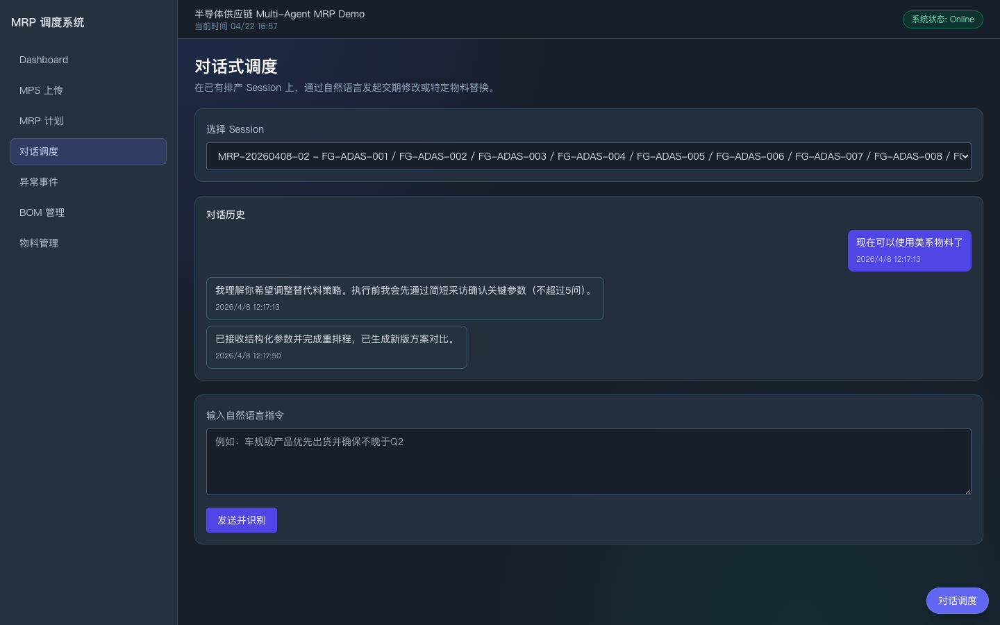
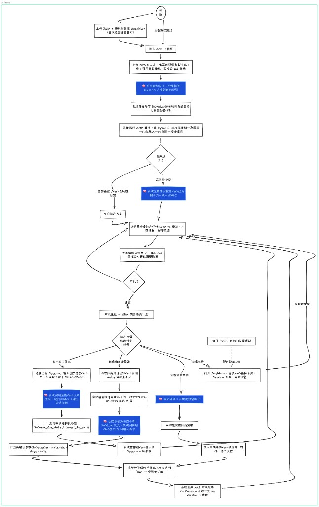

# 半导体供应链 Multi-Agent MRP Demo

> **发布版本：v0.1.0** — Multi-Agent 编排、确定性 MRP、对话式调度的可运行 Demo（详见 PRD 与 `docs/`）。

基于 PRD 的可运行 Demo，目标是验证 **Multi-Agent + 确定性 MRP 算法 + Human-in-the-loop** 在半导体供应链场景下的可行性。

## 系统界面（参考截图）

以下为本仓库内保存的当前前端界面全页截屏，便于在 GitHub 上快速了解产品形态与信息架构；本地运行以本人环境为准。

| 仪表盘 | 新建 MPS |
| :--: | :--: |
|  |  |

| 排产会话列表 | 对话式调度 |
| :--: | :--: |
|  |  |

## LLM 智能调度工作流

本系统的核心价值在于 **"确定性算法 + LLM 智能编排"** 的融合架构。以下流程图展示了 Multi-Agent 如何协同工作，以及 LLM 在各环节发挥的关键作用：



### LLM 的核心作用与优势

| 应用场景 | LLM 作用 | 传统方案痛点 | 本系统优势 |
|----------|----------|--------------|------------|
| **智能解析** | 理解自然语言输入的生产需求 | 用户需手动填写复杂表单 | 支持对话式输入，降低使用门槛 |
| **意图识别** | 识别用户"重排程"、"延期"、"替代料"等意图 | 硬编码规则难以覆盖所有场景 | 灵活理解各种表达方式 |
| **异常预警** | 生成可读的异常描述和建议 | 技术人员需人工解读数据 | 业务人员直接获取洞察 |
| **人机确认** | 生成带参数的确认提示 | 用户无法预知操作后果 | 操作前明确知晓影响范围 |
| **调度建议** | 基于约束条件生成调度策略 | 依赖专家经验，难以标准化 | 知识沉淀，新人也能上手 |

> **关键设计原则**：LLM 负责"理解"和"决策建议"，而**物料计算、重排程运算、数据同步**等关键操作由确定性算法执行，确保结果可预测、可审计、可复现。

## 技术栈

- 后端：`FastAPI` + `SQLAlchemy` + `SQLite` + `APScheduler`
- Agent 编排：`CrewAI`（当前以可测试编排器实现为主）
- 前端：`Next.js 14` + `TypeScript` + `Tailwind CSS`

## 目录结构

- `backend/`：后端服务、算法模块、Agent 层、API、测试
- `frontend/`：前端页面与 API 客户端
- `data/templates/`：Excel 模板
- `data/samples/`：示例 Excel 数据
- `docs/`：proposal/design/tasks 文档

## 快速启动

### 推荐：一键启动（最简）

在项目根目录执行：

```bash
chmod +x dev.sh
./dev.sh
```

脚本会自动完成以下步骤：

- 自动创建 `.env`（若不存在）
- 自动创建后端虚拟环境并安装依赖
- 自动安装前端依赖（首次）
- 同时启动后端（8000）与前端（3000）

停止服务：按 `Ctrl+C`

### 手动启动（可选）

1) 环境变量：

```bash
cp .env.example .env
```

2) 启动后端：

```bash
cd backend
python3 -m venv .venv
. .venv/bin/activate
pip install -r requirements.txt
python -m uvicorn app.main:app --reload --port 8000
```

后端健康检查：`http://localhost:8000/healthz`

3) 启动前端：

```bash
cd frontend
npm install
npm run dev
```

前端地址：`http://localhost:3000`

## 示例数据

可执行脚本自动生成模板和样例 Excel：

```bash
cd backend
. .venv/bin/activate
python scripts/generate_sample_excels.py
```

输出文件：

- `data/templates/mps_template.xlsx`
- `data/templates/bom_template.xlsx`
- `data/templates/materials_template.xlsx`
- `data/samples/sample_mps.xlsx`
- `data/samples/sample_bom.xlsx`
- `data/samples/sample_materials.xlsx`

## 测试

后端测试：

```bash
cd backend
. .venv/bin/activate
python -m pytest tests
```

前端检查：

```bash
cd frontend
npm run lint
```

## 当前实现范围

已完成：

- Phase 1~7：基础设施、核心算法、Agent 编排、API、可观测性、前端页面、示例数据与 E2E
- Phase 8：测试完善与覆盖增强
- 对话式调度（Session-Bound Chat）：`/chat` 页面 + 全局 `ChatPanel` + `POST /api/chat/message` / `POST /api/chat/confirm` / `GET /api/chat/{session_id}/history`
- 对话意图识别边界：LLM 仅做意图识别与参数确认提示，重排程由确定性 MRP 算法执行

已知事项：

- FastAPI 使用 `on_event`，存在 deprecation warning；后续可迁移到 lifespan 事件
- Demo 阶段使用 SQLite，适合单机验证场景
