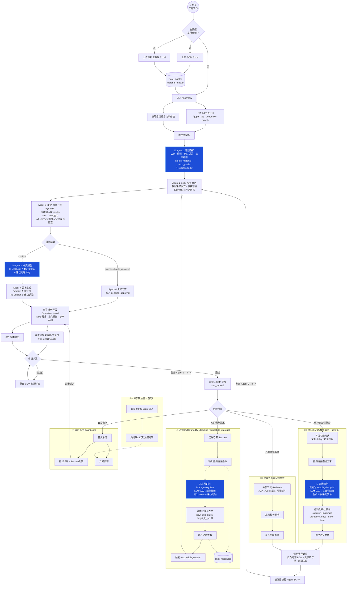

# 半导体供应链 Multi-Agent 系统——计划员完整工作流

> 🟦 蓝色节点 = LLM 参与环节；其余节点均为确定性代码或人工操作，不着色。

---

## LLM 参与边界

| 蓝色节点 | LLM 职责 | LLM 禁区 |
|---------|---------|---------|
| Agent 1 意图解析 | 自然语言→约束标签提取 | 不做数值推断 |
| Agent 4 冲突报告 | 冲突码→人类可读报告 + 建议方向 | 不做数值计算、不修改排产结果 |
| 对话意图识别 | 识别 intent_type + 生成采访问题 | 不猜测参数值、不生成排产数值 |
| 供应商异常识别 | 识别 supply_disruption + 5 问表单 | 不估算影响范围（由引擎计算） |

> LLM 不可用时自动降级为关键词规则匹配，不中断流程。
