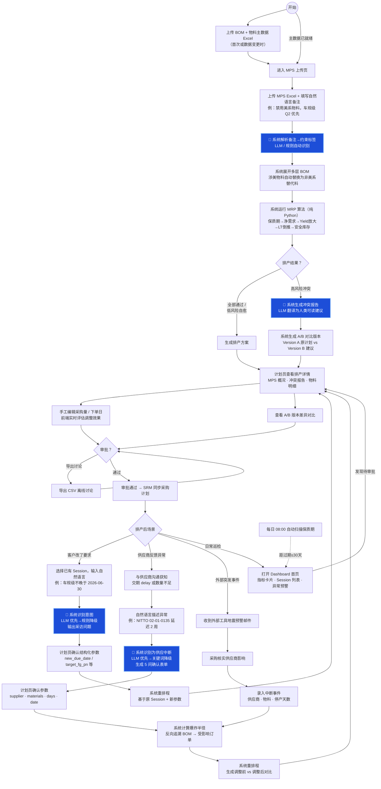

# 计划员操作视角——从拿到 MPS 到采购下发

> 🟦 蓝色 = LLM 参与（自然语言理解 / 冲突报告生成）。其余为确定性代码或人工操作。

## LLM 参与边界

| 蓝色节点 | LLM 做什么 | LLM 不做什么 |
|---------|-----------|------------|
| 解析备注→约束标签 | 自然语言→ `no_us_material` / `auto_grade` | 不推断数值 |
| 冲突报告生成 | 冲突码→人类可读建议 | 不计算、不修改排产数值 |
| 对话意图识别 | 识别 intent_type + 生成采访问题 | 不猜参数值 |
| 供应商异常识别 | 识别 `supply_disruption` + 确认表单 | 不估算爆炸半径 |

> LLM 不可用时自动降级为关键词规则匹配，不中断流程。
